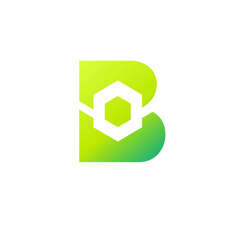
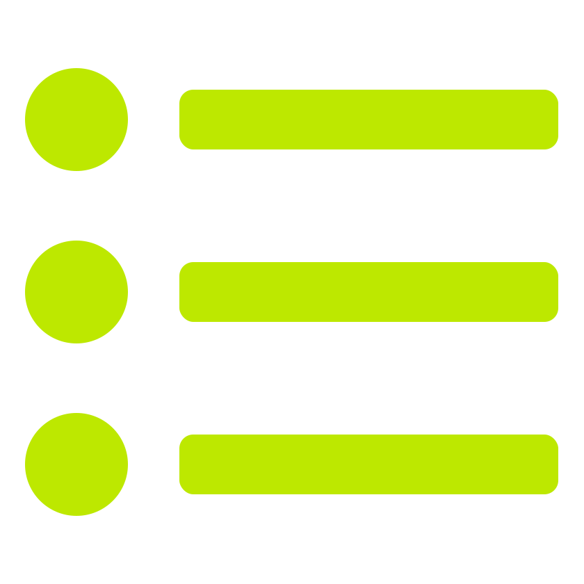
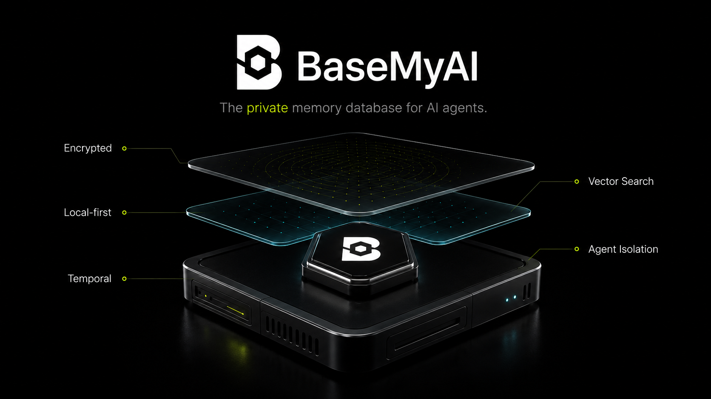
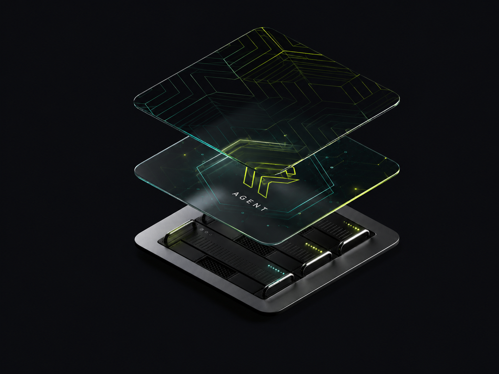
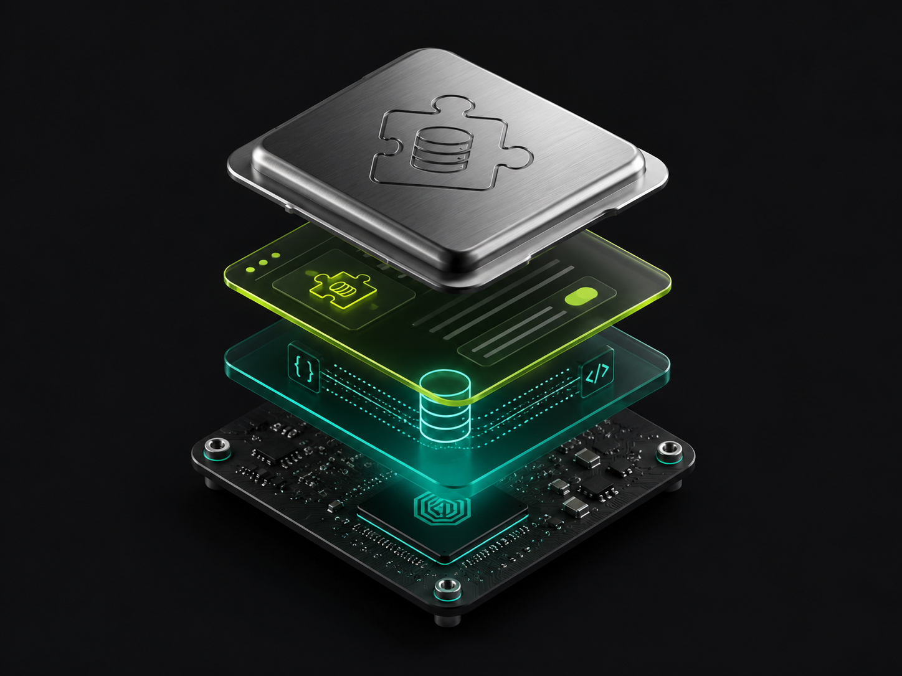

<p align="center">
  
</p>

<h3 align="center">The local memory engine for AI agents.</h3>
<p align="center"><em>Persistent · Temporal · Encrypted · 100 % local · Built in Rust</em></p>

<p align="center">
  <a href="https://github.com/basemyai/basemyai/actions/workflows/ci.yml">
    
  </a>
  &nbsp;
  <a href="https://github.com/basemyai/basemyai">
    
  </a>
  &nbsp;
  <a href="https://github.com/basemyai/basemyai">
    
  </a>
  &nbsp;
  <a href="LICENSE">
    
  </a>
</p>

<p align="center">
  <a href="https://crates.io/crates/basemyai">
    
  </a>
  &nbsp;
  <a href="https://pypi.org/project/basemyai/">
    
  </a>
  &nbsp;
  <a href="https://www.npmjs.com/package/basemyai">
    
  </a>
  &nbsp;
  
</p>

<p align="center">
  <a href="https://discord.gg/basemyai">
    
  </a>
  &nbsp;
  <a href="https://x.com/basemyai">
    
  </a>
  &nbsp;
  <a href="https://dev.to/basemyai">
    
  </a>
  &nbsp;
  <a href="https://www.linkedin.com/company/basemyai/">
    
  </a>
  &nbsp;
  <a href="https://www.youtube.com/@basemyai">
    
  </a>
</p>

<p align="center">
  <a href="https://basemyai.com/blog"></a>
  &nbsp;
  <a href="https://github.com/basemyai/basemyai"></a>
  &nbsp;
  <a href="https://www.linkedin.com/company/basemyai/"></a>
  &nbsp;
  <a href="https://x.com/basemyai"></a>
  &nbsp;
  <a href="https://www.youtube.com/@basemyai"></a>
  &nbsp;
  <a href="https://dev.to/basemyai"></a>
  &nbsp;
  <a href="https://discord.gg/basemyai"></a>
  &nbsp;
  <a href="https://stackoverflow.com/questions/tagged/basemyai"></a>
</p>

<br>

<h2>&nbsp;&nbsp;What is BaseMyAI?</h2>

BaseMyAI is a **local memory engine** built in Rust that gives AI agents persistent, temporal, multi-layered memory — vector search, knowledge graph, and time-aware retrieval — inside a single encrypted local file. Zero cloud. Zero data leaks. Zero silent downloads.

AI agents have no memory by default. Every session starts from zero. Worse — the few solutions that *do* add memory route your conversations and embeddings to a cloud vector database. For anything sensitive — personal assistants, internal tools, regulated industries — that is a non-starter. And almost none of them handle **time**: a fact that was true last quarter is treated identically to a fact that is true right now.

BaseMyAI solves all three problems in a single Rust binary:

- **Privacy-first** — everything stays on-device, in one local libSQL file, AES-256 encrypted at rest
- **Temporal** — every memory carries `valid_from` / `valid_until`; retrieval returns only what is *currently* true
- **Multi-signal** — vector similarity + knowledge graph + Reciprocal Rank Fusion in one query

<h2>&nbsp;&nbsp;Contents</h2>

- [What is BaseMyAI?](#what-is-basemyai)
- [Features](#features)
- [Architecture: core + semantics](#architecture-core--semantics)
- [The 4 memory layers](#the-4-memory-layers)
- [Phase 2 — Cognition](#phase-2--cognition)
- [Temporal RAG](#temporal-rag)
- [Encryption at rest](#encryption-at-rest)
- [Getting started](#getting-started)
- [Installation](#installation)
- [Quick look](#quick-look)
- [Consumption surfaces](#consumption-surfaces)
- [Community](#community)
- [Contributing](#contributing)
- [Security](#security)
- [License](#license)

<h2>&nbsp;&nbsp;Features</h2>

- [x] 100 % local — no data leaves your machine, no telemetry by default
- [x] Four memory layers: short-term, episodic, procedural, semantic
- [x] Temporal RAG — retrieval filtered by `valid_until`, never returns stale facts
- [x] Vector search natively inside libSQL (`vector_top_k` ANN, no extension required)
- [x] Knowledge graph — entities, relations, multi-hop traversal via recursive SQL CTE
- [x] Multi-signal retrieval with Reciprocal Rank Fusion (vector + graph, k = 60)
- [x] Adaptive forgetting — hyperbolic importance × recency, capacity-bounded GC
- [x] Episode-to-fact consolidation via injected LLM (any local runner, no hard dependency)
- [x] Hardware-aware provisioning — no silent model downloads, explicit setup command
- [x] Encryption at rest via libSQL `crypto` feature (key never stored, key never sent)
- [x] Per-agent isolation enforced at the SQL level — cross-agent leakage is a security invariant
- [x] Python SDK (PyO3 wheel), Node SDK (NAPI-RS prebuild), REST sidecar (axum), native Rust crate



<h2>&nbsp;&nbsp;Architecture: core + semantics</h2>

BaseMyAI is **two crates in one Cargo workspace**, publishable independently:

```
┌────────────────────────────────────────────────────────┐
│  basemyai          (the memory semantics)               │
│  4 memory layers · temporal RAG · per-agent isolation   │
│  adaptive forgetting · cognition · Python/Node/REST     │
└───────────────────────┬────────────────────────────────┘
                        │ built on top of
┌───────────────────────▼────────────────────────────────┐
│  basemyai-core     (business-agnostic foundation)       │
│  hardened libSQL · native vectors · Candle embeddings   │
│  optional libSQL crypto · MaintenanceWorker             │
└─────────────────────────────────────────────────────────┘
```

**`basemyai-core`** is deliberately business-agnostic. It knows libSQL pooling, native vector KNN/ANN, Candle in-process embeddings, optional encryption, and a background maintenance loop — nothing about agents, time windows, or memory layers. It provides **mechanism**; the consumer provides **meaning**.

**`basemyai`** is the memory product built on top: the four layers, temporal RAG, per-agent isolation scoped at the SQL level, and all language binding surfaces.

This split powers more than one product. **[ForgeMyAI](../forgemyai-app/)** — the local code-context engine — consumes `basemyai-core` directly as a native Rust crate (no FFI, no HTTP), building its own code-specific semantics (symbols, call graph, FTS) on the same foundation. See [`../ECOSYSTEM_ARCHITECTURE.md`](../ECOSYSTEM_ARCHITECTURE.md).

<h2>&nbsp;&nbsp;The 4 memory layers</h2>

| Layer | Holds | Lifetime |
|---|---|---|
| `short_term` | Working context for the active session | Expires fast (TTL) |
| `episodic` | What happened and when — events, interactions | Time-bounded |
| `procedural` | Learned how-to: steps, workflows, skills | Long-lived |
| `semantic` | Facts and knowledge, vector-searchable | Until explicitly invalidated |

Every layer carries `valid_from` / `valid_until` — memory is **temporal by construction**, not as an afterthought.



<h2>&nbsp;&nbsp;Phase 2 — Cognition</h2>

Beyond storage and vector search, BaseMyAI implements a full five-ingredient memory system.

### Knowledge graph

Entities and relations live in the same libSQL file alongside vectors. Multi-hop traversal via recursive SQL CTE (`UNION`, cycle-safe by construction). Scoped per `agent_id` and depth-bounded.

```rust
graph.add_entity("alice", "person", "Alice")?;
graph.add_entity("acme",  "org",    "Acme Corp")?;
graph.add_edge("alice", "works_at", "acme", 1.0)?;

let reached = graph.traverse("alice", /* max_depth */ 2)?;
```

### Multi-signal retrieval (RRF)

Fuse vector similarity, graph traversal, and any other ranking signal with **Reciprocal Rank Fusion** (k = 60). Each signal contributes a ranked list; RRF scores and merges them deterministically — no tunable weights to overfit.

```rust
let fused = rrf_fuse(&[
    Ranking { signal: "vector".into(), ids: vec![...] },
    Ranking { signal: "graph".into(),  ids: vec![...] },
], /* top_k */ 10);
```

### Adaptive forgetting

A capacity-bounded GC that keeps the most *important and recent* memories. Importance decays over time using a **hyperbolic curve** `H / (H + age)` — not exponential, which underflows to zero at real Unix timestamps.

```rust
let gc = AdaptiveForgetting {
    capacity_per_agent:    10_000,
    recency_half_life_secs: 7 * 24 * 3600,  // 1 week
};
worker.register(gc);
```

### Episode → fact consolidation

`consolidate(memory, llm)` reads recent episodes, extracts entities, relations, and facts via a structured LLM prompt, and promotes them to the knowledge graph and semantic layer — idempotently, via any local LLM runner through the injected `LlmInference` trait.

```rust
consolidate(&memory, &llm_backend).await?;
// episodes → (entity, relation, fact) → knowledge graph + semantic layer
```

<h2>&nbsp;&nbsp;Temporal RAG</h2>

A retrieval that ignores time is a retrieval that lies. BaseMyAI's core query is **hybrid**: cosine similarity via libSQL native vectors **AND** a time filter in the same SQL statement.

```
retrieve("what is the user's billing plan?")
  → ANN cosine match  (vector_top_k, native libSQL, no extension)
  → AND valid_until > now()
  → returns only memories that are both relevant AND still true
```

Vectors live **inside** libSQL via its native `F32_BLOB` support (`libsql_vector_idx`, `vector_top_k` ANN). There is no second system to sync — no Qdrant, no LanceDB, no external vector database. One file.

<h2>&nbsp;&nbsp;Encryption at rest</h2>

`basemyai` requires encryption at rest via libSQL's built-in **`crypto`** feature. The database is instantiated with an `encryption_key`; the file on disk is unreadable without it. The key is supplied at open time and never stored, never transmitted. In `basemyai-core`, encryption is optional; `basemyai` makes it mandatory.

<p align="center">
  
</p>

<h2>&nbsp;&nbsp;Getting started</h2>

Getting started with BaseMyAI takes two steps: run `basemyai setup` once to provision the embedding model for your hardware, then open a `Memory` from your language of choice.

**Python**

```python
from basemyai import Memory

mem = Memory(
    path="./agent.db",
    agent_id="assistant-42",
    encryption_key="…",
    model_path="~/.basemyai/models/all-MiniLM-L6-v2",
)

# Store a semantic fact, valid indefinitely until explicitly invalidated.
mem.remember(
    "The user is on the Pro plan.",
    layer="semantic",
    valid_until=None,
)

# Temporal RAG: relevant AND still valid, scoped to this agent.
hits = mem.recall("which plan is the user on?", k=5)
for h in hits:
    print(h.text, h.score)
```

**Node / TypeScript**

```ts
import { Memory } from "basemyai";

const mem = new Memory({
    path: "./agent.db",
    agentId: "assistant-42",
    encryptionKey: "…",
    modelPath: "…",
});

await mem.remember("The user prefers dark mode.", { layer: "procedural" });
const hits = await mem.recall("ui preferences", { k: 5 });
```

**Rust (native)**

```rust
use basemyai::{Memory, MemoryLayer};

let mem = Memory::open("./agent.db", "agent-42", &key, model_path).await?;
mem.remember("User is on Pro plan.", MemoryLayer::Semantic, None).await?;
let hits = mem.recall("billing plan", 5).await?;
```

<h2>&nbsp;&nbsp;Installation</h2>

BaseMyAI is designed to be simple to install. Precompiled wheels (Python) and NAPI prebuilds (Node) mean **no C or Rust toolchain required** on the client machine.

<h4>&nbsp;&nbsp;Python (all platforms)</h4>

```bash
pip install basemyai
```

<h4>&nbsp;&nbsp;Node / TypeScript</h4>

```bash
npm install basemyai
```

<h4>&nbsp;&nbsp;Rust (native crate)</h4>

```toml
# Full memory product
basemyai = "0.1"

# Business-agnostic foundation only (e.g. for ForgeMyAI)
basemyai-core = "0.1"
```

<h4>&nbsp;&nbsp;Docker (REST sidecar)</h4>

```bash
docker run --rm -p 8080:8080 \
  -e BASEMYAI_ENCRYPTION_KEY="…" \
  -v ./data:/data \
  basemyai/basemyai:latest
```

<h4>&nbsp;&nbsp;Install on Linux</h4>

```bash
curl --proto '=https' --tlsv1.2 -sSf https://install.basemyai.com | sh
```

<h4>&nbsp;&nbsp;Install on Windows</h4>

```ps1
iwr https://windows.basemyai.com -useb | iex
```

<h4>&nbsp;&nbsp;Install on macOS</h4>

```bash
brew install basemyai/tap/basemyai
```

<h4>Hardware-aware setup (run once)</h4>

```bash
basemyai setup
# Detecting hardware…  GPU: CUDA 12.3 · 8 GB VRAM
# Selected model: all-MiniLM-L6-v2 (384d, ~90 MB)
# Fetching model… ████████████████ 100%  SHA-256 ✓
# Saved to ~/.basemyai/models/
```

There is **no silent download at first run**. The fetch happens only here, with your explicit consent. The embedder then receives an already-resolved model path and device — it never decides or downloads anything itself.

<h2>&nbsp;&nbsp;Quick look</h2>

Store an episodic memory — what happened and when.

```python
mem.remember(
    "User asked to refactor the auth module at 14:32.",
    layer="episodic",
    valid_until="2025-12-31T00:00:00Z",
)
```

Store a procedural skill the agent learned.

```python
mem.remember(
    "To deploy: run `make release`, tag the commit, push to origin.",
    layer="procedural",
)
```

Multi-signal recall — fuses vector similarity and graph traversal automatically.

```python
hits = mem.recall_multi(
    query="how do I deploy?",
    signals=["vector", "graph"],
    k=10,
)
```

Invalidate a fact that is no longer true.

```python
mem.invalidate(record_id="semantic:abc123")
# valid_until is set to now() — future recalls skip this record
```

Traverse the knowledge graph up to 3 hops.

```python
graph = mem.graph()
graph.add_entity("project-x", "project", "Project X")
graph.add_edge("alice", "owns", "project-x", weight=1.0)
reachable = graph.traverse("alice", max_depth=3)
```

Consolidate recent episodes into durable facts.

```python
mem.consolidate(llm=my_local_llm)
# reads last N episodes → extracts entities, relations, facts
# writes to knowledge graph + semantic layer (idempotent)
```

<h2>&nbsp;&nbsp;Consumption surfaces</h2>

The same Rust core, four ways to consume it:

| Surface | For | Crate consumed | Tech |
|---|---|---|---|
| **Python SDK** | Python agent builders (LangChain, LlamaIndex, custom) | `basemyai` | PyO3 + precompiled wheel |
| **Node SDK** | JS / TS agent builders | `basemyai` | NAPI-RS + prebuild |
| **REST sidecar** | Go, Ruby, any HTTP client | `basemyai` | Single self-contained binary (axum) |
| **Native Rust crate** | Rust programs — e.g. ForgeMyAI | `basemyai-core` | Direct link, zero FFI overhead |

<h2>&nbsp;&nbsp;Community</h2>

Join our growing community around the world, for help, ideas, and discussions regarding BaseMyAI.

- View our official [Blog](https://basemyai.com/blog)
- Chat live with us on [Discord](https://discord.gg/basemyai)
- Follow us on [X](https://x.com/basemyai)
- Connect with us on [LinkedIn](https://www.linkedin.com/company/basemyai/)
- Visit us on [YouTube](https://www.youtube.com/@basemyai)
- Join our [Dev community](https://dev.to/basemyai)
- Questions tagged #basemyai on [Stack Overflow](https://stackoverflow.com/questions/tagged/basemyai)

<h2>&nbsp;&nbsp;Contributing</h2>

We would love for you to get involved with BaseMyAI development! If you wish to help, you can learn more about how you can contribute to this project in the [contribution guide](CONTRIBUTING.md).

Architecture decisions are documented in [ADR.md](ADR.md). A decision that changes always produces a **new ADR** — existing ADRs are never edited. Read the ADR before touching cross-cutting concerns.

Rust gate before every commit:

```bash
cargo clippy --workspace --all-targets -- -D warnings
cargo test --workspace
```

<h2>&nbsp;&nbsp;Security</h2>

For security issues, kindly email us at [security@basemyai.com](mailto:security@basemyai.com) instead of posting a public issue on GitHub.

- **100 % local** — no data leaves your machine, no telemetry by default
- **Per-agent isolation** — every query is filtered by `agent_id` at the SQL level; cross-agent leakage is a security invariant, not a config option
- **Encrypted at rest** — libSQL `crypto` feature, AES-256, key never stored
- **No silent network** — the embedder receives a local model path and never auto-downloads

See [SECURITY.md](SECURITY.md) for the full threat model and vulnerability reporting process.

<h2>&nbsp;&nbsp;License</h2>

Source code for BaseMyAI is released under the [MIT License](LICENSE).

- `basemyai-core` — MIT
- `basemyai` — MIT
- Language SDKs (Python, Node) — MIT

For more information, see [LICENSE](LICENSE).
