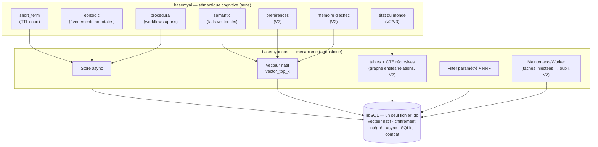

# Vision — BaseMyAI, le kernel mémoire des agents IA

**Statut** : Vision stratégique | **Date** : 2026-06 | **Horizon** : 2026–2028
**Cohérence** : ce document s'appuie sur `ADR.md` (source de vérité technique), `PRD.md`, `README.md`, `../ECOSYSTEM_ARCHITECTURE.md`. Là où il décrit du futur (V2/V3), il l'indique explicitement et ne contredit aucun ADR acté.

> **Lecture rapide.** BaseMyAI veut être l'**OS mémoire cognitif** des agents IA : un moteur de mémoire **hybride** (vecteurs + graphe + temps + consolidation + oubli), **local-first**, **mono-fichier**, **privacy-by-design**. La V1 (en cours) pose le socle libSQL, le vecteur natif, l'épisodique/sémantique, le RAG temporel et l'isolation. La cognition (graphe, consolidation, oubli adaptatif, retrieval multi-signal) est la roadmap 2027–2028 — bâtie **sur le même fichier libSQL**, pas sur un nouveau système.

---

## 1. Résumé exécutif

Les agents IA de 2026 sont amnésiques. Le goulet critique de la période **2026–2028** n'est plus la qualité du modèle de raisonnement — il est devenu suffisamment bon — mais la **mémoire persistante** qui transforme un modèle stateless en agent qui *apprend de son utilisateur dans le temps*.

La thèse de BaseMyAI : **la mémoire d'agent est une couche d'infrastructure à part entière — un « kernel mémoire » — et non une feature jetable à bricoler par-dessus une base vectorielle.** Tout comme un OS gère la mémoire d'un processus (allocation, hiérarchie, éviction, persistance), BaseMyAI gère la mémoire d'un agent : ce qu'il retient, comment il le retrouve, ce qu'il consolide en savoir durable, et ce qu'il oublie.

Trois paris structurants qui distinguent BaseMyAI du reste du marché :

1. **Mémoire hybride, pas vecteur-seul.** Les vecteurs donnent une mémoire épisodique superficielle. Une mémoire efficace combine **similarité sémantique (vecteurs)**, **relations et entités (graphe)**, **temporalité (validité)**, **consolidation** (épisodes → faits) et **oubli intelligent**. *Les vecteurs seuls ne suffisent pas.*
2. **Local-first, mono-fichier, privacy-by-design.** Les données de mémoire — conversations, profils, préférences — sont parmi les plus sensibles d'un produit IA. BaseMyAI les garde **sur la machine**, dans **un seul fichier**, chiffrées au repos. Zéro cloud par défaut.
3. **L'hybride complet dans un seul moteur embarqué.** Là où les concurrents imposent du cloud (Mem0, Zep managé) ou un poly-store local à orchestrer (Cognee : Kuzu + LanceDB + SQLite), BaseMyAI vise **vecteur + graphe + temporel + consolidation + oubli dans un unique fichier libSQL embarqué**.

Ce document explique le problème (§2), la nature de la mémoire hybride visée (§3), **comment elle tient sur notre socle libSQL réel** (§4 — le cœur), les innovations à construire (§5), le paysage concurrentiel (§6), la feuille de route incrémentale (§7) et le cadre décisionnel qui justifie l'ambition infra long terme tout en livrant en V1 (§8).

---

## 2. Le problème

### 2.1 L'amnésie des agents

Un agent stateless repart de zéro à chaque session. Le modèle qui a aidé l'utilisateur hier ne se souvient de rien aujourd'hui. Les contournements actuels sont tous insuffisants : réinjecter tout l'historique dans le prompt (coûteux, fenêtre limitée, pas de recherche), un store en RAM (volatil), ou une base vectorielle cloud (données hors machine, latence, coût récurrent). Aucun ne donne, simplement et en local, **persistance + recherche sémantique + notion du temps**.

### 2.2 Le vecteur-seul est insuffisant

La réponse standard de l'industrie — « RAG sur une base vectorielle » — produit une **mémoire épisodique superficielle** : un sac de chunks intemporels, sans relations explicites, sans notion de validité, sans consolidation. Ses limites sont structurelles :

- **Pas de relations.** « Alice travaille chez Acme, qui a racheté Beta en mars » est trois faits liés. Le vecteur-seul les noie en chunks indépendants ; impossible de traverser *Alice → employeur → acquisitions*.
- **Pas de temporalité.** « L'utilisateur est sur le plan Free » (vrai au T1) et « sur le plan Pro » (vrai au T2) reviennent avec la même confiance. L'agent affirme alors des faits périmés (cf. ADR-005).
- **Pas de consolidation.** Mille épisodes redondants restent mille vecteurs ; jamais distillés en un fait durable, jamais dédupliqués.
- **Pas d'oubli.** La base grossit sans borne ; le bruit dilue le signal ; rien ne décide ce qui mérite d'être gardé.

Une mémoire qui ignore relations, temps, consolidation et oubli n'est pas une mémoire — c'est un cache de recherche.

### 2.3 Le cloud = fuite de données

Les rares solutions de mémoire « clé en main » envoient conversations et embeddings vers une base vectorielle managée. Pour tout ce qui touche à des données sensibles — assistants personnels, outils internes, santé, finance, juridique, défense — c'est un **blocage compliance** (RGPD, HDS, secret professionnel) autant qu'un risque. La mémoire d'un agent est l'endroit où se concentre le plus d'information privée sur l'utilisateur ; l'exfiltrer vers un tiers est inacceptable pour le persona « contrainte de confidentialité » (cf. PRD §3, Persona 3).

**Le verrou à lever** : offrir l'hybride complet — vecteur + graphe + temps + consolidation + oubli — **sans jamais quitter la machine**, dans un format mono-fichier qu'un développeur intègre en deux lignes.

---

## 3. La mémoire hybride

### 3.1 Les cinq ingrédients

Une mémoire d'agent efficace n'est pas un index, c'est un **système** combinant cinq mécanismes :

| Ingrédient | Rôle | Question à laquelle il répond |
|---|---|---|
| **Vecteurs** | Similarité sémantique | « Qu'est-ce qui *ressemble* à ma requête ? » |
| **Graphe** | Entités, relations, traversée | « Qu'est-ce qui est *relié* à ça ? » |
| **Temporel** | Validité dans le temps (`valid_from`/`valid_until`) | « Qu'est-ce qui est *encore vrai* ? » |
| **Consolidation** | Épisodes → faits durables, fusion, dédup | « Qu'ai-je *appris* de tout ça ? » |
| **Oubli** | Éviction par importance/récence/surprise, décroissance | « Que puis-je *laisser partir* ? » |

Le vecteur trouve le *pertinent*, le graphe trouve le *connexe*, le temporel garde le *valide*, la consolidation produit le *durable*, l'oubli préserve le *signal*. Aucun seul ne suffit ; leur fusion est la mémoire.

### 3.2 Les types de mémoire — nos 4 couches, étendues

ADR-004 a acté **4 couches** mémoire, modélisées en tables distinctes dans `basemyai` (jamais dans `basemyai-core`), chacune portant `valid_from`/`valid_until` (ADR-005) et filtrée par `agent_id` (ADR-006). La vision **étend** ce socle à six types, par réconciliation et ajout — sans rien renier :

| Type | Statut | Couche ADR-004 | Contenu |
|---|---|---|---|
| **Épisodique** | ✅ V1 (acté) | `episodic` | Événements horodatés : ce qui s'est passé et quand. |
| **Sémantique** | ✅ V1 (acté) | `semantic` | Faits et connaissances, recherchables vectoriellement, jusqu'à invalidation. |
| **Procédurale** | ◐ V1 schéma / V2 exploitée | `procedural` | Workflows, compétences, « comment faire X » appris. |
| **Court terme** | ✅ V1 (acté) | `short_term` | Contexte de travail de la session courante (TTL court). |
| **Préférences** | ○ V2 (roadmap) | extension | Goûts et choix stables de l'utilisateur (dark mode, ton, langue…). |
| **Mémoire d'échec** | ○ V2 (roadmap) | extension | Bugs, erreurs, impasses passés — pour **ne pas les répéter**. |
| **État du monde** | ○ V2/V3 (roadmap) | extension | État mutable courant (snapshot du monde tel que l'agent le croit). |

**Réconciliation.** Les couches `short_term`, `episodic`, `procedural`, `semantic` d'ADR-004 restent le tronc. **Préférences**, **mémoire d'échec** et **état du monde** sont des **types additionnels** posés selon le même patron (table distincte, `valid_from/until`, `agent_id`) — donc **aucune révision d'ADR-004**, seulement une extension cohérente livrée en V2/V3. La mémoire d'échec et les préférences sont, conceptuellement, des spécialisations sémantiques/procédurales ; l'état du monde est une projection temporelle « courante » du graphe.



> Le diagramme illustre l'invariant d'ADR-001 : **mécanisme au core, sens au consommateur**. Les types de mémoire (le *sens*) vivent dans `basemyai` ; le *mécanisme* (Store, vecteur, graphe-en-tables, Filter, Worker) vit dans `basemyai-core` ; tout retombe dans **un seul fichier libSQL**.

---

## 4. Comment ça tient sur notre socle — le point clé

C'est ici que la vision « OS mémoire » cesse d'être un vœu et devient **réalisable sur l'infrastructure réelle déjà choisie**. Le pivot **libSQL (ADR-011)** est ce qui rend l'hybride complet possible **mono-fichier**, sans renier aucun principe.

### 4.1 Le graphe sans base graphe — tables + CTE récursives

L'objection naturelle à « ajouter un graphe » est : « il faut Kuzu ou Neo4j ». **Non.** ADR-011 l'écrit noir sur blanc : libSQL étant **SQLite-compatible**, le **graphe (entités/relations) se modélise en tables `entities` / `edges` + CTE récursives (`WITH RECURSIVE`) dans le même fichier**. La traversée multi-sauts (« Alice → employeur → acquisitions ») est une requête SQL récursive, pas un système externe.

```sql
-- conceptuel (V2) : entités + relations, mono-fichier libSQL
-- entities(id, agent_id, kind, label, valid_from, valid_until, importance)
-- edges(src, dst, agent_id, relation, weight, valid_from, valid_until)

WITH RECURSIVE traverse(node, depth) AS (
    SELECT id, 0 FROM entities WHERE id = ?1 AND agent_id = ?2
    UNION ALL
    SELECT e.dst, t.depth + 1
    FROM   edges e JOIN traverse t ON e.src = t.node
    WHERE  e.agent_id = ?2
      AND (e.valid_until IS NULL OR e.valid_until > ?3)   -- temporel (ADR-005)
      AND  t.depth < ?4                                    -- borne de profondeur
)
SELECT * FROM traverse;
```

Conséquences directes, toutes alignées sur les ADR :

- **Pas de Kuzu/Neo4j, pas de poly-store.** Le graphe partage le fichier, les transactions ACID, le chiffrement et l'isolation `agent_id` du reste. Mono-fichier préservé (cf. ADR-011, alternatives rejetées : « DB graphe externes — viole le mono-fichier local »).
- **Le graphe est du *sens*, donc dans `basemyai`.** Les tables `entities`/`edges` et les CTE vivent dans `basemyai` ; `basemyai-core` n'expose que `Store.conn()` + migrations + `Filter`. **Test d'agnosticité intact** (ADR-001 / CLAUDE.md) : aucun concept d'entité/relation ne fuit dans le core.

### 4.2 Le vecteur — natif, pas d'extension

ADR-011 supprime `sqlite-vec` au profit du **vecteur natif libSQL** (`F32_BLOB`, `libsql_vector_idx`, `vector_top_k` en ANN). La similarité sémantique est donc déjà dans le socle V1, **sans extension C à linker** (le risque D4 d'origine est supprimé). La couche `semantic` et, plus tard, préférences / mémoire d'échec s'y appuient directement.

### 4.3 L'oubli — le `MaintenanceWorker`, déjà là

L'**oubli intelligent** n'est pas un nouveau sous-système : c'est une **tâche injectée dans le `MaintenanceWorker`** (ADR-008). Le core fait tourner la boucle de fond (mécanisme) ; `basemyai` enregistre la politique d'éviction/décroissance (sens). C'est exactement le patron déjà utilisé pour le GC des lignes `valid_until` expirées. L'oubli adaptatif V2 (importance/récence/surprise, compression sémantique) est une **extension de tâche**, pas une refonte — et il ne bloque jamais le chemin critique.

### 4.4 Le retrieval multi-signal — `Filter` + RRF

ADR-011 conserve un `Filter` **paramétré** (fragment SQL + valeurs liées, anti-injection, ADR-006) et l'API async. Le retrieval multi-signal (vecteur + traversée de graphe + récence + importance) se compose donc ainsi : chaque signal produit un classement, et la **fusion par rank fusion / RRF** les agrège. Le core fournit le KNN natif et le mécanisme de filtre ; `basemyai` orchestre les signaux et fusionne — **mécanisme au core, sens au consommateur**.

### 4.5 Async, mono-fichier, agnostique — les invariants qui rendent la cognition possible

Trois propriétés du socle, posées par ADR-011 et CLAUDE.md, sont précisément ce que la cognition exige :

- **Async-natif.** Consolidation (appels LLM), retrieval multi-signal et sync future sont I/O-bound et concurrents. `Store` est async ; l'`Embedder` reste sync (CPU-bound), enveloppé dans `spawn_blocking` si besoin.
- **Mono-fichier.** Vecteur + graphe + temporel + métadonnées d'oubli partagent **un `.db`**. Pas de second système à synchroniser, pas de cohérence inter-stores à garantir.
- **`basemyai-core` reste agnostique ; la cognition vit dans `basemyai`.** Le core ne connaîtra jamais « entité », « préférence », « épisode », « importance ». Il expose Store/vecteur/Filter/Worker ; tout le sens cognitif est au-dessus. Cette ligne de partage est non négociable (ADR-001, test d'agnosticité en CI).

> **En une phrase** : grâce au pivot libSQL, l'« OS mémoire cognitif » n'exige **aucun nouveau backend** — il exige d'écrire, dans `basemyai`, des **tables, des CTE, des tâches de worker et une fusion de classements** au-dessus du socle déjà acté.

---

## 5. Innovations à construire

> Ces chantiers sont la **roadmap V2/V3**. Ils ne sont **pas** du code existant : la consolidation, le graphe et l'oubli adaptatif sont à bâtir. Cette section décrit la cible, pas l'état présent.

### 5.1 Pipelines de consolidation

Transformer des **épisodes** bruts en **faits sémantiques** durables : extraction d'entités et de relations (peuplant le graphe §4.1), fusion et déduplication des faits redondants, promotion `episodic → semantic`. Combinaison **LLM + heuristiques** : le LLM extrait et résume (couche d'inférence model-agnostic, §5.5), les heuristiques dédupliquent et arbitrent. La consolidation tourne en tâche de fond (worker), jamais sur le chemin critique.

### 5.2 Oubli adaptatif

Au-delà du GC temporel V1 : **éviction par score combiné importance × récence × « surprise »** (un souvenir inattendu mérite d'être gardé), **décroissance** progressive de l'importance, et **compression sémantique** (remplacer N épisodes similaires par un fait consolidé). Implémenté comme **tâche du `MaintenanceWorker`** (§4.3) — l'oubli est une politique enregistrée par `basemyai`, pas une primitive du core.

### 5.3 Retrieval multi-signal

Fusionner **vecteur + traversée de graphe + récence + importance** par **rank fusion / RRF** (§4.4), au lieu du cosine pur. Le résultat est plus robuste : un souvenir peut remonter parce qu'il est sémantiquement proche *et/ou* relié à l'entité courante *et/ou* récent *et/ou* important.

### 5.4 Traçabilité et explicabilité (provenance)

Chaque souvenir doit porter sa **provenance** (de quel épisode/source il dérive, par quelle consolidation) et chaque rappel doit pouvoir expliquer **pourquoi** il a été retourné (quels signaux ont contribué, avec quels poids dans le RRF). C'est à la fois un argument de confiance produit et un levier de débogage de la mémoire.

### 5.5 Couche d'inférence model-agnostic

La consolidation et l'extraction supposent un LLM. BaseMyAI ne s'y couple pas : une **couche d'inférence model-agnostic** abstrait le fournisseur (local de préférence, pour rester *privacy-first* ; distant en option explicite). Cohérent avec l'esprit ADR-003/ADR-010 (l'embedder reçoit un modèle résolu, ne décide rien) : le *mécanisme* d'appel est neutre, le *choix* du modèle est une décision produit/utilisateur.

### 5.6 Isolation multi-agent + sync P2P optionnelle

L'isolation `agent_id` au niveau SQL (ADR-006) est déjà l'invariant de sécurité V1. La vision y ajoute, en V3, une **synchronisation P2P optionnelle** entre instances (jamais via un cloud central par défaut), pour partager une mémoire entre machines d'un même utilisateur/équipe sans renier le local-first. Le chemin libSQL → **Turso DB** (réécriture pure Rust, async-natif ; ADR-011) ouvre la porte à de la réplication ; activée en option, jamais imposée.

---

## 6. Paysage concurrentiel

| Solution | Approche mémoire | Stockage | Local-first | Financement / traction | Limite face à BaseMyAI |
|---|---|---|---|---|---|
| **Mem0** | Hybride vecteur + graphe, hiérarchie user/session/agent | Vecteur + graphe (souvent cloud/managé) | Partiel | ~24 M$ levés, >41 K⭐ | Pousse vers le cloud ; pas mono-fichier embarqué |
| **Zep / Graphiti** | Graphe de connaissances **temporel** | Graphe (Neo4j-like) | Non (managé) | Meilleur sur LongMemEval (~63,8 %) | Cloud/managé, pas de mono-fichier local |
| **Cognee** | Poly-store cognitif local-first | **Kuzu + LanceDB + SQLite** | Oui | Open-source | Multi-systèmes à orchestrer ; pas un seul fichier |
| **Letta / MemGPT** | Mémoire hiérarchique auto-éditée | Variable | Partiel | Forte notoriété recherche | Orienté orchestration/agent runtime, pas moteur de stockage embarqué |
| **Redis Agent Memory** | In-memory, court terme | Redis (RAM) | Self-host possible | Écosystème Redis | **Pas de graphe**, volatil, pas de temporel riche |
| **Cloudflare Agent Memory** | Mémoire managée cloud | Edge cloud | Non | Plateforme CF | Cloud par conception ; fuite de données pour les personas compliance |

**Benchmarks de référence** à viser pour situer la qualité : **LongMemEval**, **LoCoMo**, **BEAM**.

### Le différenciateur BaseMyAI

> **Local-first + mono-fichier (libSQL) + privacy + l'hybride complet dans un seul moteur embarqué.**

Là où Mem0/Zep/Cloudflare imposent du cloud ou du managé, et où Cognee impose un **poly-store** (trois systèmes à orchestrer), BaseMyAI vise **vecteur + graphe + temporel + consolidation + oubli dans un unique fichier libSQL**, embarqué, chiffré, isolé par agent — installable en `pip install basemyai` sans qu'aucune donnée ne quitte la machine. C'est la combinaison qu'aucun concurrent n'offre aujourd'hui d'un seul tenant.

---

## 7. Feuille de route incrémentale

Approche **MVP → hybride → full**, strictement séquencée sur les ADR. Chaque phase est utile seule ; aucune ne jette la précédente.

### 2026 — Phase 1 : Fondations *(en cours — socle V1)*

**Ce qui est déjà bâti / proche** (acté par les ADR, scaffold posé avec contrats/traits et `todo!()` documentés — cf. CLAUDE.md) :

- ✅ **Socle libSQL** (ADR-011) : `Store` async, mono-fichier, SQLite-compat.
- ✅ **Vecteur natif** (`F32_BLOB`, `vector_top_k`) — pas d'extension à linker.
- ✅ **Couches épisodique & sémantique** (sous-ensemble des 4 couches ADR-004) + `short_term`.
- ✅ **RAG temporel** (`valid_from`/`valid_until`, requête hybride cosine + filtre ; ADR-005).
- ✅ **Isolation `agent_id`** au niveau SQL — invariant de sécurité (ADR-006).
- ✅ **Embedder Candle** in-process, `all-MiniLM-L6-v2` 384d, jamais d'auto-download (ADR-003/010).
- ✅ **`MaintenanceWorker`** : boucle de fond, tâches injectées ; GC des lignes expirées (ADR-008).
- ✅ **Chiffrement** au repos via feature `crypto` libSQL (obligatoire dans `basemyai` ; ADR-007/011).
- ✅ **Bindings** Python (PyO3, wheel) / Node (NAPI-RS, prebuild) / sidecar REST (ADR-009).

> Honnêteté de périmètre : la Phase 1 est de la **mémoire hybride *partielle*** (vecteur + temporel + isolation). Le graphe, la consolidation et l'oubli adaptatif n'en font **pas** partie — ce sont les Phases 2 et 3.

### 2027 — Phase 2 : Cognition *(roadmap — à construire)*

- ○ **Graphe** entités/relations en **tables + CTE récursives** dans le fichier libSQL (§4.1) — pas de Kuzu/Neo4j.
- ○ **Retrieval multi-signal** : vecteur + graphe + récence + importance, fusionnés par **RRF** (§4.4).
- ○ **Consolidation** : épisodes → faits, extraction d'entités, fusion/dédup (LLM + heuristiques ; §5.1).
- ○ **Oubli adaptatif** : éviction importance/récence/surprise, décroissance, compression sémantique (§5.2).
- ○ **Procédural exploité** + nouveaux types **préférences** et **mémoire d'échec** (§3.2).
- ○ **Provenance/explicabilité** : traçabilité des souvenirs et du « pourquoi » d'un rappel (§5.4).

### 2028 — Phase 3 : Écosystème *(roadmap — à construire)*

- ○ **Multi-agent + sync P2P optionnelle** (jamais cloud-central par défaut ; chemin Turso DB pur Rust ; §5.6).
- ○ **Multi-modèles / plugins** : couche d'inférence model-agnostic, modèles d'embedding multiples/multilingues (réservés post-V1 par ADR-003/010).
- ○ **Observabilité** : métriques de mémoire, inspection de la provenance, dashboard.
- ○ **Scalabilité & enterprise** : montée en charge, durcissement multi-tenant, garanties compliance étendues.
- ○ **État du monde** : type de mémoire « snapshot mutable courant » (§3.2).

---

## 8. Cadre décisionnel — pourquoi l'ambition infra, pas un MVP vecteur jetable

**La question.** Pourquoi viser un « kernel mémoire » hybride sur le long terme, plutôt que livrer vite un petit wrapper RAG vecteur-seul ?

**La réponse, en quatre points :**

1. **Le vecteur-seul est un cul-de-sac, pas un MVP.** Un wrapper cosine-pur ne se *prolonge* pas en mémoire hybride : il faut, tôt ou tard, ré-architecturer pour le temps, le graphe, la consolidation et l'oubli. Construire jetable, c'est payer deux fois. BaseMyAI choisit un **socle qui porte la cible** dès le départ.

2. **Le socle est déjà le bon — et il n'impose pas l'ambition trop tôt.** C'est la force du pivot libSQL (ADR-011) : le **même fichier** qui sert la V1 (vecteur natif + temporel + isolation) porte, sans nouveau backend, le graphe (CTE), l'oubli (worker) et le multi-signal (Filter + RRF). L'ambition long terme **ne coûte rien à la V1** — elle est latente dans le socle, activée phase par phase.

3. **L'agnosticité du core protège l'incrément.** Parce que `basemyai-core` reste mécanisme-pur (ADR-001), chaque innovation cognitive s'ajoute **dans `basemyai`** sans toucher au socle ni casser les autres consommateurs du core. On peut donc livrer V1 maintenant et empiler la cognition ensuite, sans dette de rupture.

4. **Le marché 2026–2028 récompense l'infra, pas la feature.** La mémoire est *le* goulet des agents sur cette fenêtre. Les acteurs qui gagnent sont ceux qui en font une couche d'infrastructure défendable (Mem0, Zep), pas un gadget. Le différenciateur de BaseMyAI — l'hybride complet, local-first, mono-fichier — n'existe que si l'on vise l'infra dès le départ.

**La règle de conduite** qui réconcilie ambition et pragmatisme : **viser l'OS mémoire, livrer par tranches utiles.** Chaque phase est déployable et utile seule (la V1 donne déjà une vraie mémoire persistante, temporelle, isolée et chiffrée) ; aucune phase n'est jetée par la suivante ; et le socle libSQL garantit qu'aucune tranche future n'exige de tout réécrire. On ne construit pas un MVP qu'on jettera — on construit le **kernel**, une couche cohérente à la fois.

---

*BaseMyAI : le kernel mémoire des agents IA. Local-first, mono-fichier, hybride. Vecteur + graphe + temps + consolidation + oubli — dans un seul fichier, sur votre machine.*
